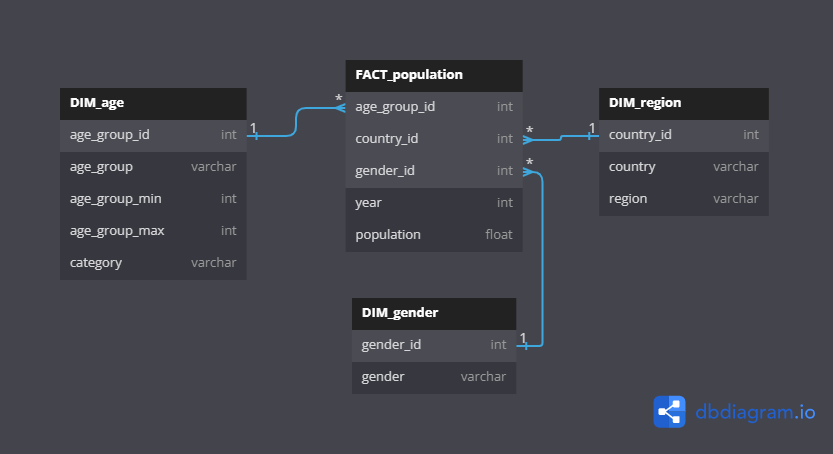
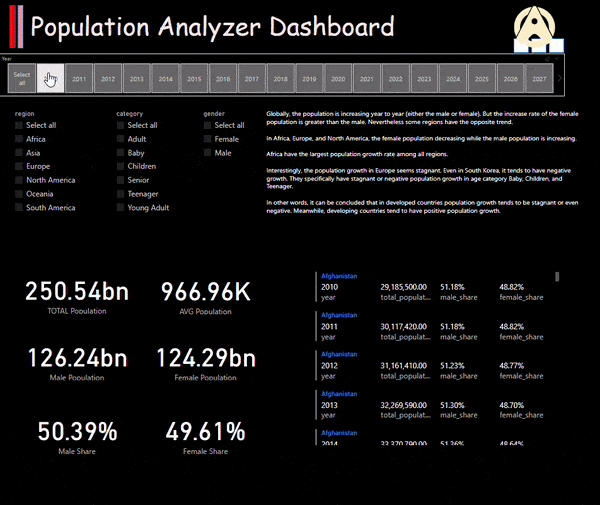
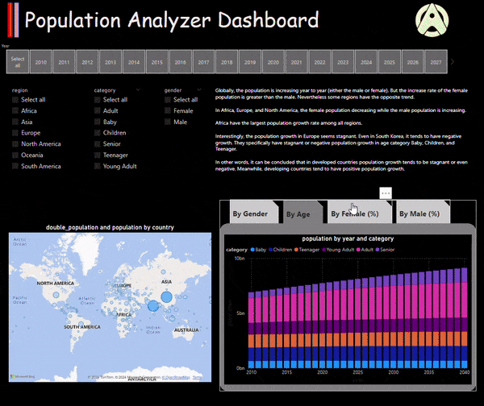
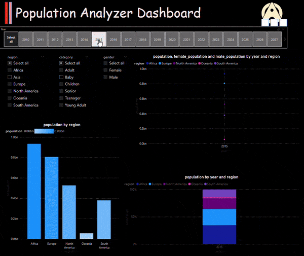
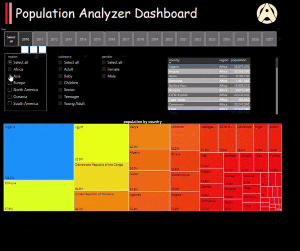
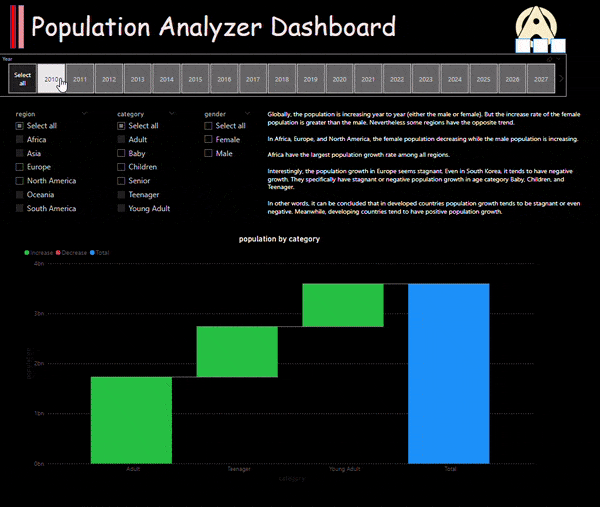

# population-analyzer-dashboard
In this project, we leverage the powerful data visualization and analysis capabilities of Power BI to create an insightful dashboard that visualizes population trends over a 30-year period (2010-2040).

The primary goals of this dashboard are:
- **Visualization**: To create clear and informative visual representations of population trends.
- **Analysis**: To analyze population growth, declines, and demographic shifts over time in each region and country.
- **Interactivity**: To provide an interactive user experience where users can explore data based on different filters and parameters.

## 1. Dataset
Worldwide population in country-level from 2010 to 2040.

Here are the files included to build the dashboard:
- population-2010-2019.csv
- population-2020-2029.csv
- population-2030-2040.xlsx
- code.txt

## 2. Methods and Processing
For the database design and the relationship basically using star schema design with three dimension tables connected by single fact table.

Here, I used [dbdiagram](https://dbdiagram.io/) to generate the ERD:

Following are procedures to build the dashboard:
- Load dataset files
- Concatenate files into single table (utilize Power Query)
- Data cleansing (utilize Power Query)
- Data transformation (utilize Power Query)
- Create custom and measure columns (using Power Query and DAX)
- Define the relationship between tables
- Generate the visualizations
- Combine the visualization into single coherent dashboard

## 3. Insights
The dashboard split by multiple pages:
1. **Number Tiles** $\rightarrow$ high-level information represented by cards
2. **Population by Gender** $\rightarrow$ population by gender (male or female) filter to get some perspectives about population growth
3. **Population by Region** $\rightarrow$ population by regions (continents) or countries filter to get some perspectives about population growth
4. **Population in Treemap Chart** $\rightarrow$ number of population proportion by countries using treemap chart
5. **Population in Waterfall Chart** $\rightarrow$ age category (age group) population proportion sing waterfall chart

Based on the data here are some insights obtained:
- Globally, the population is increasing year to year (either the male or female). But the increase rate of the female population is greater than the male. Nevertheless some regions have the opposite trend.
- In Africa, Europe, and North America, the female population decreasing while the male population is increasing.
- Africa have the largest population growth rate among all regions.
- Interestingly, the population growth in some developed countries (mostly in Europe) seems stagnant. Even in South Korea, it tends to have negative growth. They specifically have stagnant or negative population growth in age category Baby, Children, and Teenager.
- In other words, it can be concluded that in developed countries population growth tends to be stagnant or even negative. Meanwhile, developing countries tend to have positive population growth.

## 4. Result Preview
### 4.1. Number Tiles

### 4.2. Population by Gender

### 4.3. Population by Region

### 4.4. Population in Treemap Chart

### 4.5. Population in Waterfall Chart

